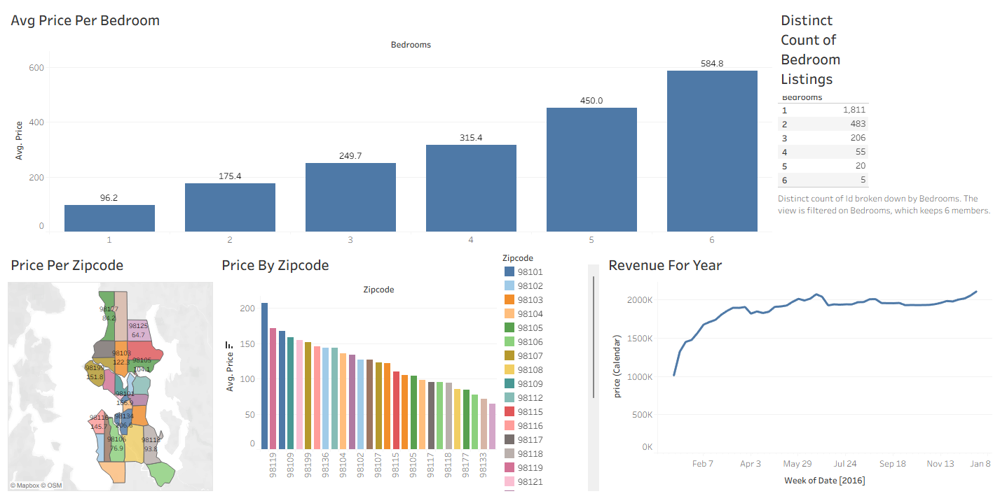

# Seattle Airbnb Tableau Dashboard

## Project Overview

This project uses Tableau to analyze Airbnb listing data from Seattle, Washington. The dashboard examines listing prices, bedroom counts, ZIP-code differences, and pricing trends throughout 2016.

## Dashboard Features

* Average price by number of bedrooms
* Number of listings by bedroom count
* Average price by ZIP code
* Geographic comparison of Seattle ZIP codes
* Weekly pricing trends throughout 2016

## Key Findings

* Average prices increased from approximately $96 for one-bedroom listings to approximately $585 for six-bedroom listings.
* One-bedroom properties were the most common, with 1,811 listings.
* Average listing prices varied considerably across Seattle ZIP codes.
* The aggregated weekly price trend increased early in the year and remained relatively stable during much of the remaining period.

## Tools and Skills

* Tableau
* Data visualization
* Dashboard design
* Data joins
* Geographic mapping
* Bar charts
* Line charts
* Trend analysis

## Files

* `airbnb-tableau-dashboard.twb` — Tableau workbook containing the worksheets and dashboard
* `airbnb-dashboard.png` — Preview image of the completed dashboard

## Dataset

The dataset used for this project was obtained from Kaggle. It contains the Listings, Calendar, and Reviews tables used to build the Tableau dashboard.

The original Excel file exceeds GitHub's browser upload limit, so it is not stored in this repository.

[Download the Airbnb Listings 2016 Dataset from Kaggle](https://www.kaggle.com/datasets/alexanderfreberg/airbnb-listings-2016-dataset)

## Project Background

This project was completed as part of a guided Tableau portfolio exercise. I built the worksheets, connected and joined the data, assembled the dashboard, and documented the analysis to strengthen my Tableau and data-visualization skills.

